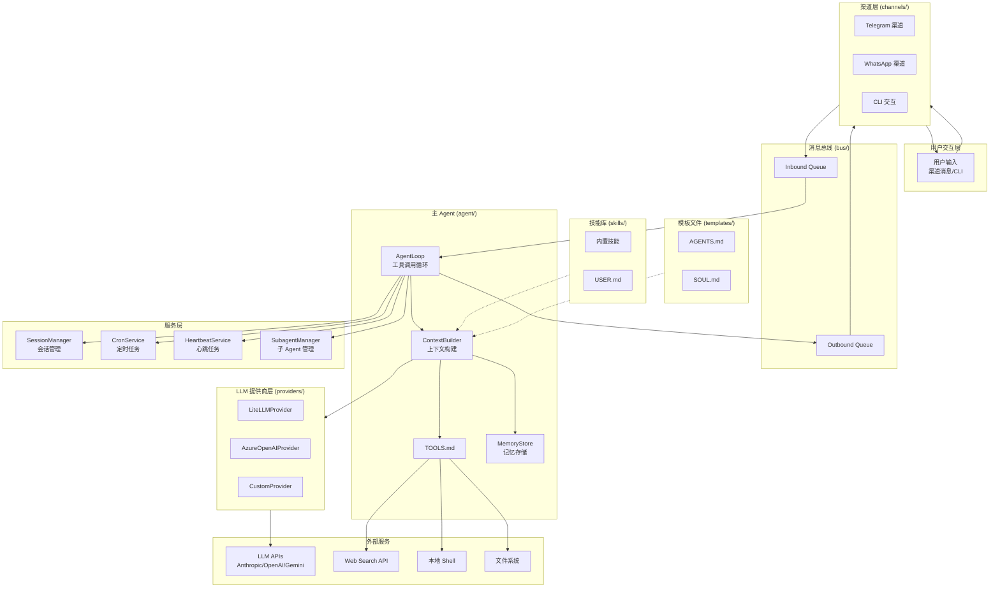
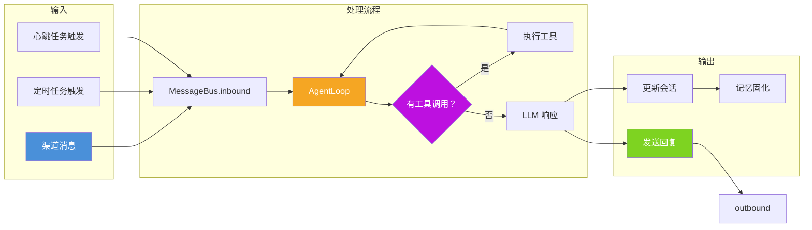
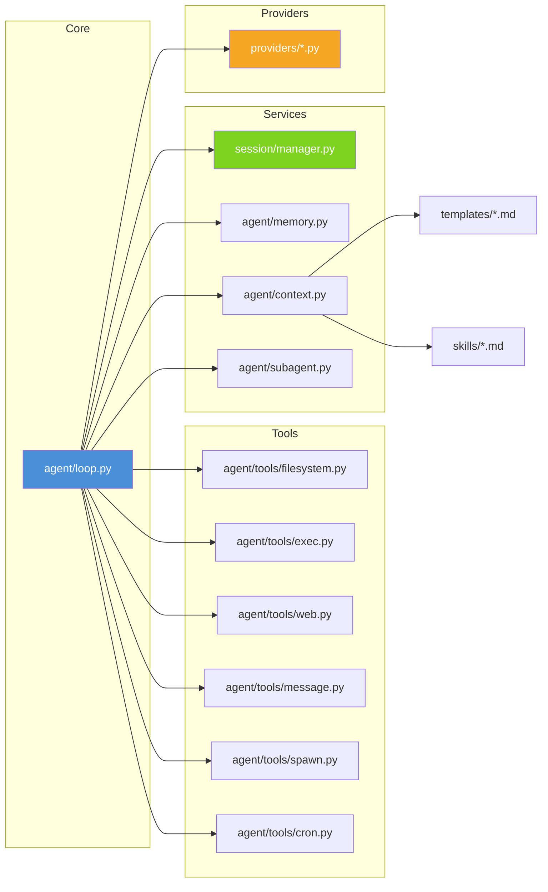
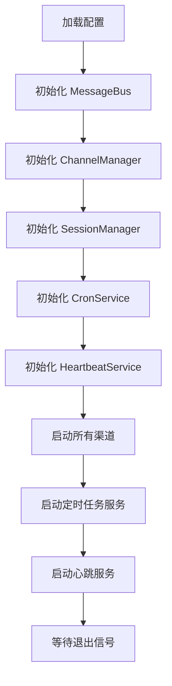
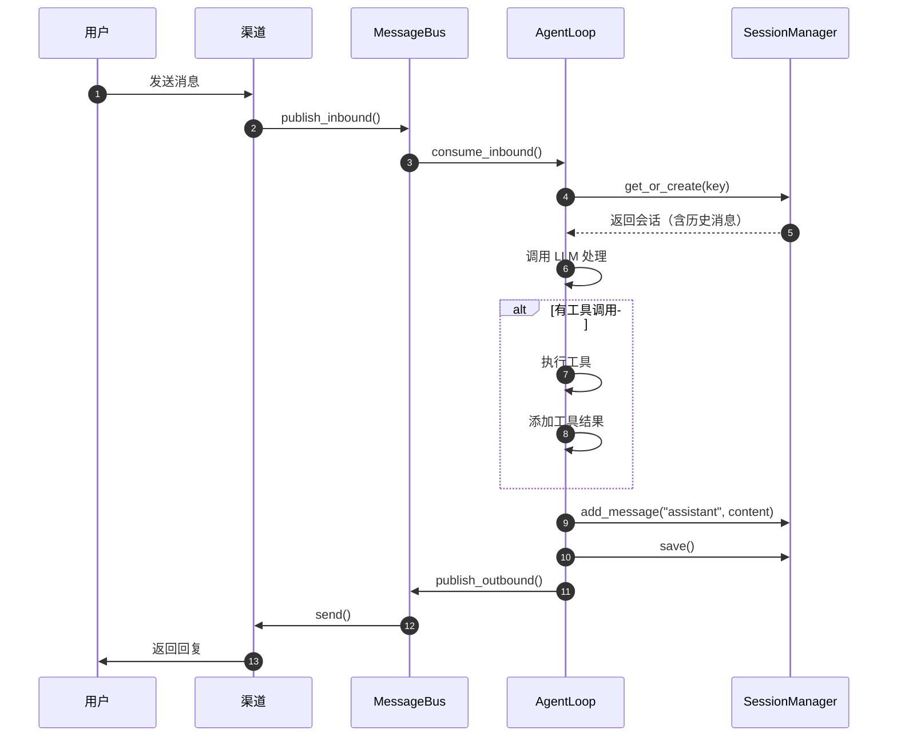
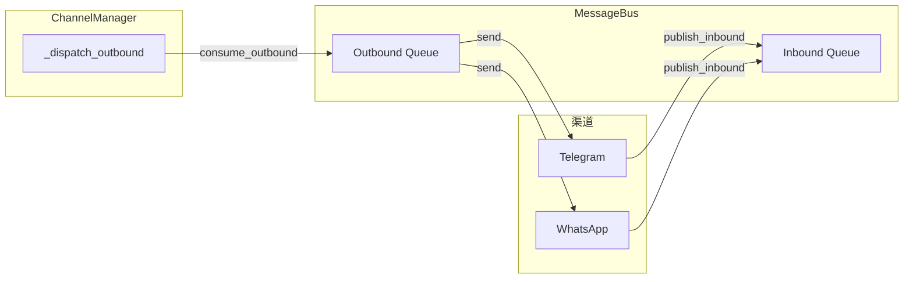
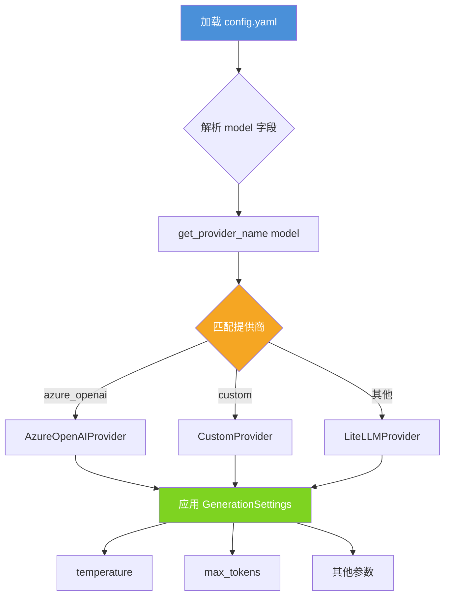
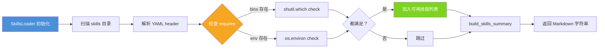
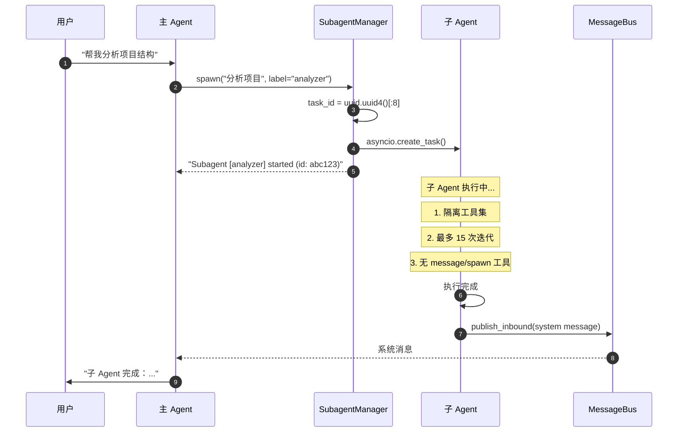

# Nanobot 系统架构文档

> 📌 **文档说明**
> - 本文档按照 9 个核心问题组织，图文并茂地解析 Nanobot 系统架构
> - **Mermaid 图表**: 可在支持 Mermaid 的 Markdown 查看器中直接渲染（如 GitHub、Obsidian、VS Code）
> - **ASCII 艺术图**: 纯文本格式，任何地方都可以查看
> - **PlantUML 源码**: 可复制到 [PlantText](https://www.planttext.com/) 在线生成专业图表
>
> 📁 **推荐查看方式**: VS Code + Markdown Preview Mermaid Support 插件

---

## A) 系统主要构件及其相互关系

### A.1 核心构件列表

| 构件类别 | 构件名称 | 文件位置 | 职责描述 |
|---------|---------|---------|---------|
| **Agent** | 主 Agent | `agent/loop.py` | 接收用户消息，调用 LLM，执行工具，发送响应 |
| **Agent** | 子 Agent | `agent/subagent.py` | 后台任务执行，隔离工具集，有限迭代（最多 15 次） |
| **Bus** | MessageBus | `bus/queue.py` | 异步消息队列（inbound/outbound） |
| **Session** | SessionManager | `session/manager.py` | 会话管理（JSONL 持久化） |
| **Provider** | LiteLLMProvider | `providers/litellm_provider.py` | 通用提供商，支持 20+ LLM 服务 |
| **Provider** | AzureOpenAIProvider | `providers/azure_openai_provider.py` | 直接 Azure OpenAI API |
| **Service** | CronService | `cron/service.py` | 定时任务调度 |
| **Service** | HeartbeatService | `heartbeat/service.py` | 心跳任务（30 分钟检查） |
| **Channel** | ChannelManager | `channels/manager.py` | 渠道管理（Telegram、WhatsApp 等） |
| **Tool** | ToolRegistry | `agent/tools/` | 工具注册表（文件、exec、web 等） |

### A.2 系统架构图



### A.3 数据流架构



### A.4 组件依赖关系



---

## B) Templates 目录下 *.md 文件的作用和使用技巧

### B.1 模板文件列表

| 文件 | 作用 | 主要内容 |
|-----|------|---------|
| `AGENTS.md` | 代理指令 | 定义 Agent 的职责、行为规范、任务类型 |
| `SOUL.md` | 性格定义 | 定义 Agent 的性格、沟通风格、价值观 |
| `USER.md` | 用户偏好 | 定义用户信息、时区、语言、工作上下文 |
| `TOOLS.md` | 工具说明 | 工具使用注意事项、安全限制、输出规范 |
| `HEARTBEAT.md` | 心跳任务 | 定义周期性检查的任务清单 |

### B.2 模板文件在系统中的位置

```
上下文构造流程
│
├── 1. System Prompt
│   ├── AGENTS.md  → 代理指令
│   ├── SOUL.md    → 性格和风格
│   ├── USER.md    → 用户偏好
│   └── TOOLS.md   → 工具使用说明
│
├── 2. Memory (可选)
│   └── MEMORY.md/HISTORY.md → 长期记忆
│
├── 3. Skills (可选)
│   └── SKILL*.md → 技能说明
│
└── 4. History (会话消息)
    └── 历史对话记录
```

### B.3 模板文件使用技巧

**AGENTS.md 使用技巧：**
- 明确 Agent 的核心职责和边界
- 定义特殊情况的处理方式
- 指定定时任务的管理规则

**SOUL.md 使用技巧：**
- 定义简洁的沟通风格（如"简洁明了"）
- 指定语言偏好（如"使用中文回复"）
- 设定错误处理态度

**USER.md 使用技巧：**
- 填写准确的时区信息
- 指定工作日和时间
- 列出关注的话题领域

**TOOLS.md 使用技巧：**
- 说明 exec 工具的超时限制
- 列出危险命令黑名单
- 定义输出截断规则

---

## C) 定时任务和心跳任务的管理和执行过程

### C.1 定时任务（CronService）

**三种调度类型：**

| 类型 | 配置字段 | 描述 | 示例 |
|-----|---------|------|------|
| `at` | `at_ms` | 一次性任务，在指定时间执行 | 2026-03-19 10:00:00 |
| `every` | `every_ms` | 周期性任务，按间隔执行 | 每 30 分钟 |
| `cron` | `expr` | cron 表达式，灵活调度 | `0 9 * * *` |

**定时任务执行流程：**

```mermaid
flowchart TD
    subgraph Config["配置阶段"]
        A1[用户添加定时任务] --> A2[cron add]
        A2 --> A3[保存到 jobs.json]
        A3 --> A4[CronService 加载]
    end

    subgraph Schedule["调度阶段"]
        B1[CronService.start()] --> B2[_arm_timer()]
        B2 --> B3{有下一步任务？}
        B3 -->|是 | B4[设置 asyncio.sleep]
        B3 -->|否 | B5[等待]
        B4 --> B6[_on_timer()]
    end

    subgraph Execute["执行阶段"]
        C1[扫描到期任务] --> C2{任务启用？}
        C2 -->|是 | C3[_execute_job()]
        C2 -->|否 | C4[跳过]
        C3 --> C5{on_job 回调？}
        C5 -->|是 | C6[调用 Agent]
        C5 -->|否 | C7[直接执行]
        C6 --> C8[更新 last_run]
        C7 --> C8
        C8 --> C9[计算 next_run]
        C9 --> C10[保存 jobs.json]
    end

    Config --> Schedule
    Schedule --> Execute
    Execute --> B2

    style Config fill:#4A90D9,color:#fff
    style Schedule fill:#F5A623,color:#fff
    style Execute fill:#7ED321,color:#fff
```

**关键代码位置：** `nanobot/cron/service.py`

| 方法 | 职责 |
|-----|------|
| `start()` | 启动服务，加载任务，设置定时器 |
| `_arm_timer()` | 计算下次唤醒时间，设置 asyncio 延迟 |
| `_on_timer()` | 扫描到期任务并执行 |
| `_execute_job()` | 执行单个任务，更新状态 |
| `add_job()` | 添加新任务 |
| `remove_job()` | 移除任务 |
| `enable_job()` | 启用/禁用任务 |
| `run_job()` | 手动执行任务 |

### C.2 心跳任务（HeartbeatService）

**两阶段设计：**

```
┏━━━━━━━━━━━━━━━━━━━━━━━━━━━━━━━━━━━━━━━━━━━━━━━━━━━━━━━━━━━━━━━┓
┃                    心跳任务执行流程                              ┃
┗━━━━━━━━━━━━━━━━━━━━━━━━━━━━━━━━━━━━━━━━━━━━━━━━━━━━━━━━━━━━━━━┛

  【启动阶段】
      ┌──────────────┐
      │ Heartbeat    │ start() → 30 分钟循环
      │ Service      │
      └──────┬───────┘
             │
             ▼
      ┌──────────────┐
      │  读取         │ HEARTBEAT.md
      │ HEARTBEAT.md │
      └──────┬───────┘
             │
  【决策阶段】│ 两阶段设计
             ▼
      ┌──────────────┐
      │  Phase 1:    │ LLM 调用 decide 工具
      │  _decide()   │ ┌─────────────────┐
      │              │ │ action: skip/run│
      │              │ │ tasks: "..."    │
      │              │ └─────────────────┘
      └──────┬───────┘
             │
             │ action="run"?
             ▼
      ┌──────────────┐      ┌──────────────┐
      │    是        │      │    否        │
      │  执行任务     │      │  跳过本次     │
      └──────┬───────┘      └──────────────┘
             │
  【执行阶段】│
             ▼
      ┌──────────────┐
      │  Phase 2:    │ 执行 tasks 内容
      │  _run()      │ (可能是 cron add 等)
      └──────┬───────┘
             │
             ▼
      ┌──────────────┐
      │  更新         │ 记录执行时间
      │ last_run_ms  │
      └──────────────┘
```

**关键代码位置：** `nanobot/heartbeat/service.py`

| 方法 | 职责 |
|-----|------|
| `start()` | 启动 30 分钟循环检查 |
| `_decide()` | Phase 1: LLM 决定是否执行 |
| `_run()` | Phase 2: 执行任务内容 |

---

## D) CLI 的实现机制

### D.1 CLI 架构

**框架：** Typer（基于 Click 的现代化封装）

**主要组件：**

| 组件 | 文件位置 | 职责 |
|-----|---------|------|
| CLI 入口 | `cli/commands.py` | 定义命令和子命令 |
| 配置加载 | `config/loader.py` | 加载和保存配置 |
| Provider 创建 | `cli/commands.py` | 根据配置创建 LLM Provider |

### D.2 命令结构

```
nanobot
├── agent          # 单次交互或交互模式
├── gateway        # 启动多渠道服务
├── onboard        # 初始化配置
└── status         # 查看状态
```

### D.3 两种运行模式

**模式 1：单次消息模式**
```bash
nanobot agent --message "你好"
```
- 发送单条消息
- 等待响应
- 退出

**模式 2：交互模式**
```bash
nanobot agent
```
- 启动 REPL 循环
- 支持多轮对话
- 使用 prompt_toolkit 提供历史记录和补全

### D.4 Gateway 模式

```bash
nanobot gateway
```

**启动流程：**



**关键代码位置：** `cli/commands.py`

```python
@app.command()
def gateway():
    """启动多渠道网关服务"""
    config = load_config()
    bus = MessageBus()
    channels = ChannelManager(config, bus)
    sessions = SessionManager(workspace)
    cron = CronService(cron_path, on_job)
    heartbeat = HeartbeatService(config, bus)

    asyncio.run(run_services(channels, cron, heartbeat))
```

---

## E) Session 的作用和管理过程

### E.1 Session 的作用

| 作用 | 说明 |
|-----|------|
| **对话历史存储** | 保存用户与 Agent 的完整对话历史 |
| **上下文构造** | 为 LLM 调用提供历史消息 |
| **记忆固化基础** | 支持将消息归档到 MEMORY.md/HISTORY.md |
| **跨会话持久化** | 会话数据持久化到 JSONL 文件 |

### E.2 Session 数据结构

```python
@dataclass
class Session:
    key: str                        # 会话键："channel:chat_id"
    messages: list[dict]            # 消息列表（追加式）
    created_at: datetime            # 创建时间
    updated_at: datetime            # 更新时间
    metadata: dict                  # 元数据
    last_consolidated: int          # 已归档消息数量
```

### E.3 Session 管理流程

**SessionManager 核心方法：**

| 方法 | 职责 |
|-----|------|
| `get_or_create(key)` | 获取或创建会话 |
| `_load(key)` | 从 JSONL 文件加载 |
| `save(session)` | 保存到 JSONL 文件 |
| `invalidate(key)` | 从缓存中移除 |
| `list_sessions()` | 列出所有会话 |

**消息处理流程：**



### E.4 JSONL 文件格式

```jsonl
{"_type": "metadata", "key": "telegram:123456", "created_at": "2026-03-19T10:00:00", "updated_at": "2026-03-19T10:05:00", "metadata": {}, "last_consolidated": 10}
{"role": "user", "content": "你好", "timestamp": "2026-03-19T10:00:00"}
{"role": "assistant", "content": "你好！有什么我可以帮助你的？", "timestamp": "2026-03-19T10:00:01"}
```

### E.5 last_consolidated 机制

```
会话消息：[m0, m1, m2, m3, m4, m5, m6, m7, m8, m9, m10, m11]
                              ↑
                    last_consolidated = 5

未归档消息：m5 之后的消息 (m6-m11)
已归档消息：m0-m4 已固化到 MEMORY.md/HISTORY.md
```

---

## F) 渠道的配置和管理、数据交换机制

### F.1 渠道配置

```yaml
# config.yaml
channels:
  telegram:
    enabled: true
    bot_token: "YOUR_BOT_TOKEN"
    allow_from: ["*"]  # 或 ["user_id_1", "user_id_2"]

  whatsapp:
    enabled: false
    phone_number: "+1234567890"
    allow_from: ["*"]

  send_progress: true      # 发送进度消息
  send_tool_hints: false   # 发送工具提示
```

### F.2 渠道发现机制

**自动发现流程：**

```
1. pkgutil.scan() 扫描内置渠道
       ↓
2. entry_points() 加载插件渠道
       ↓
3. 遍历 config.channels 配置
       ↓
4. 检查 enabled 字段
       ↓
5. 实例化并启动渠道
```

### F.3 渠道数据交换机制

**InboundMessage（渠道 → Agent）：**

```python
InboundMessage {
    channel: "telegram"          # 渠道名称
    chat_id: "123456789"         # 聊天 ID
    sender_id: "user_abc"        # 发送者 ID
    content: "你好"               # 消息内容
    media: null                  # 媒体文件（可选）
    metadata: {}                 # 元数据
}
```

**OutboundMessage（Agent → 渠道）：**

```python
OutboundMessage {
    channel: "telegram"          # 渠道名称
    chat_id: "123456789"         # 聊天 ID
    content: "你好！..."          # 消息内容
    metadata: {
        "_progress": false,      # 是否为进度消息
        "_tool_hint": false      # 是否为工具提示
    }
}
```

### F.4 ChannelManager 数据流



### F.5 BaseChannel 抽象类

| 抽象方法 | 职责 |
|---------|------|
| `start()` | 启动渠道监听 |
| `stop()` | 停止渠道 |
| `send(msg)` | 发送消息到渠道 |

| 通用方法 | 职责 |
|---------|------|
| `is_allowed(sender_id)` | 检查白名单 |
| `_handle_message()` | 处理接收的消息 |
| `transcribe_audio()` | 语音转文字 |

---

## G) 基础模型的配置和上下文构造、反馈解析处理过程

### G.1 Provider 配置流程



### G.2 Provider 路由机制

**匹配优先级：**

1. **Direct 优先**: `is_direct=True` 的提供商（如 azure_openai）
2. **Gateway 兜底**: `is_gateway=True` 的提供商（如 openai, anthropic）
3. **Model 匹配**: 通过 `keywords` 字段匹配模型名称

**ProviderSpec 字段：**

```python
@dataclass(frozen=True)
class ProviderSpec:
    name: str                    # 配置字段名
    keywords: tuple[str, ...]    # 模型名称匹配
    env_key: str                 # LiteLLM 环境变量
    display_name: str
    litellm_prefix: str
    is_gateway: bool             # 网关型
    is_local: bool               # 本地部署
    is_oauth: bool               # OAuth vs API Key
    is_direct: bool              # 绕过 LiteLLM
    supports_prompt_caching: bool
```

### G.3 上下文构造流程

```
┌─────────────────────────────────────────────────────────────────┐
│                    上下文构造流程                                │
├─────────────────────────────────────────────────────────────────┤
│                                                                 │
│  ContextBuilder.build_messages()                                │
│                                                                 │
│  1. System Prompt                                               │
│     ┌───────────────────────────────────────────────────────┐  │
│     │ # Identity                                            │  │
│     │ 你是纳米机器人...                                     │  │
│     │                                                       │  │
│     │ ---                                                   │  │
│     │ # AGENTS.md                                           │  │
│     │ # SOUL.md                                             │  │
│     │ # USER.md                                             │  │
│     │ # TOOLS.md                                            │  │
│     └───────────────────────────────────────────────────────┘  │
│                                                                 │
│  2. Memory (可选)                                               │
│     ┌───────────────────────────────────────────────────────┐  │
│     │ # Memory                                              │  │
│     │ - 长期记忆内容...                                     │  │
│     └───────────────────────────────────────────────────────┘  │
│                                                                 │
│  3. Skills (可选)                                               │
│     ┌───────────────────────────────────────────────────────┐  │
│     │ # Skills                                              │  │
│     │ ## SKILL-WEATHER                                      │  │
│     │ ## SKILL-CALCULATOR                                   │  │
│     └───────────────────────────────────────────────────────┘  │
│                                                                 │
│  4. History (会话消息)                                          │
│     ┌───────────────────────────────────────────────────────┐  │
│     │ {"role": "user", "content": "..."}                    │  │
│     │ {"role": "assistant", "content": "..."}               │  │
│     │ {"role": "tool", "tool_call_id": "...", "content": ".."}││
│     └───────────────────────────────────────────────────────┘  │
│                                                                 │
└─────────────────────────────────────────────────────────────────┘
```

### G.4 LLM 响应解析

```python
@dataclass
class LLMResponse:
    content: str | None                    # 文本回复
    tool_calls: list[ToolCallRequest]      # 工具调用列表
    finish_reason: str = "stop"            # 结束原因
    usage: dict[str, int]                  # Token 用量
    reasoning_content: str | None          # 推理内容
    thinking_blocks: list[dict] | None     # 思考块

    @property
    def has_tool_calls(self) -> bool:
        return bool(self.tool_calls)
```

### G.5 AgentLoop 处理流程

```
1. 获取工具定义
   ↓
2. 调用 LLM: chat_with_retry(messages, tools)
   ↓
3. 解析 LLMResponse
   ↓
   ├── 有 tool_calls → 执行工具 → 添加结果 → 回到步骤 2
   └── 无 tool_calls → 返回最终响应
```

---

## H) SKILLS 的管理调用过程

### H.1 Skills 文件结构

```
skills/
├── builtin/                      # 内置技能
│   ├── SKILL-WEATHER.md
│   └── SKILL-CALCULATOR.md
└── workspace/                    # 用户自定义技能
    ├── SKILL-CUSTOM.md
    └── SKILL-ANOTHER.md
```

### H.2 SKILL.md 文件格式

```markdown
---
name: 技能名称
description: 技能描述
version: 1.0
always: false
requires:
  bins: ["git", "node"]
  env: ["API_KEY"]
---

# 技能内容

这里是技能的详细说明和使用方法...
```

### H.3 SkillsLoader 架构



### H.4 技能调用流程

```
┌─────────────────────────────────────────────────────────────────┐
│                    技能调用流程                                  │
├─────────────────────────────────────────────────────────────────┤
│                                                                 │
│  1. Agent 初始化 → SkillsLoader.scan()                          │
│                                                                 │
│  2. 检查每个技能:                                                │
│     ┌───────────────────────────────────────────────────────┐  │
│     │ - 解析 YAML header                                    │  │
│     │ - 检查 bins (命令行工具)                                │  │
│     │ - 检查 env (环境变量)                                  │  │
│     └───────────────────────────────────────────────────────┘  │
│                                                                 │
│  3. ContextBuilder.build_system_prompt()                        │
│     ┌───────────────────────────────────────────────────────┐  │
│     │ parts = [identity, bootstrap, memory, skills]         │  │
│     │                                                       │  │
│     │ skills_summary = loader.build_skills_summary()        │  │
│     │ parts.append(f"# Skills\n\n{skills_summary}")         │  │
│     └───────────────────────────────────────────────────────┘  │
│                                                                 │
│  4. System Prompt 发送给 LLM                                     │
│     - LLM 读取技能说明                                           │
│     - 根据情况使用技能知识                                       │
│                                                                 │
│  5. (可选) 技能绑定工具 → 直接调用                               │
│                                                                 │
└─────────────────────────────────────────────────────────────────┘
```

### H.5 always 技能

```python
class SkillsLoader:
    def get_always_skills(self) -> list[str]:
        """获取标记为 always=true 的技能"""
        always_skills = []
        for skill in self.list_skills():
            if skill.get("always", False):
                always_skills.append(skill["name"])
        return always_skills
```

---

## I) 子 Agent 的启动和管理

### I.1 SubagentManager 架构

```python
class SubagentManager:
    def spawn(self, task: str, label: str | None = None) -> str:
        """生成子 Agent 任务"""
        task_id = str(uuid.uuid4())[:8]
        bg_task = asyncio.create_task(
            self._run_subagent(task_id, task, label, origin)
        )
        self._running_tasks[task_id] = bg_task
        return f"Subagent [{label}] started (id: {task_id})"

    async def _run_subagent(self, task_id, task, label, origin):
        # 1. 创建隔离工具集
        tools = ToolRegistry()
        tools.register(ReadFileTool, WriteFileTool, ExecTool, WebSearchTool)

        # 2. 运行有限迭代循环（最多 15 次）
        iteration = 0
        while iteration < 15:
            response = await provider.chat_with_retry(...)
            if response.has_tool_calls:
                # 执行工具
            else:
                final_result = response.content
                break

        # 3. 宣布结果
        await self._announce_result(task_id, label, task, final_result, origin)
```

### I.2 子 Agent 执行流程



### I.3 主 Agent 与子 Agent 工具对比

```
┌─────────────────────────────────────────────────────────────────┐
│                    主 Agent 与子 Agent 关系                        │
├─────────────────────────────────────────────────────────────────┤
│                                                                 │
│  主 Agent                                                        │
│  ┌───────────────────────────────────────────────────────────┐ │
│  │ 可用工具：                                                 │ │
│  │ ✓ read_file    ✓ write_file                               │ │
│  │ ✓ exec         ✓ web_search                               │ │
│  │ ✓ message (send/wait)                                     │ │
│  │ ✓ spawn (生成子 Agent)                                     │ │
│  │ ✓ cron                                                    │ │
│  └───────────────────────────────────────────────────────────┘ │
│                           │                                     │
│                           │ spawn()                             │
│                           ▼                                     │
│  子 Agent                                                        │
│  ┌───────────────────────────────────────────────────────────┐ │
│  │ 可用工具：                                                 │ │
│  │ ✓ read_file    ✓ write_file                               │ │
│  │ ✓ exec         ✓ web_search                               │ │
│  │ ✗ message (无，防止与渠道交互)                               │ │
│  │ ✗ spawn (无，防止无限递归)                                  │ │
│  │                                                         │ │
│  │ 限制：最多 15 次迭代                                         │ │
│  └───────────────────────────────────────────────────────────┘ │
│                           │                                     │
│                           │ _announce_result()                  │
│                           ▼                                     │
│  系统消息                                                         │
│  ┌───────────────────────────────────────────────────────────┐ │
│  │ Subagent Task Completed                                    │ │
│  │ ID: abc123                                                │ │
│  │ Label: analyzer                                           │ │
│  │ Task: 分析项目结构                                          │ │
│  │ Result: ...                                               │ │
│  └───────────────────────────────────────────────────────────┘ │
│                                                                 │
└─────────────────────────────────────────────────────────────────┘
```

### I.4 子 Agent 管理方法

| 方法 | 职责 |
|-----|------|
| `spawn(task, label)` | 生成子 Agent 任务 |
| `_run_subagent()` | 运行子 Agent 循环 |
| `_announce_result()` | 将结果发布到消息总线 |
| `list_tasks()` | 列出运行中的任务 |
| `cancel_task(task_id)` | 取消任务 |

---

## 附录：配置说明

### 1. 环境变量 (.env)

```
ANTHROPIC_AUTH_TOKEN=你的 API 密钥
ANTHROPIC_BASE_URL=https://api.anthropic.com
ANTHROPIC_MODEL=claude-sonnet-4-5-20250929
```

### 2. Cron 表达式说明

```
格式：分 时 日 月 周
      │  │  │  │  │
      │  │  │  │  └─ 星期 (0-6, 0=周日)
      │  │  │  └──── 月份 (1-12)
      │  │  └─────── 日期 (1-31)
      │  └────────── 小时 (0-23)
      └───────────── 分钟 (0-59)

示例:
- "0 9 * * *"    → 每天 9:00
- "0 9 * * 1-5"  → 每周一至周五 9:00
- "0 */2 * * *"  → 每 2 小时
- "30 8 1 * *"   → 每月 1 号 8:30
```

### 3. 系统目录结构

```
nanobot/
├── agent/                       # Agent 核心模块
│   ├── loop.py                 # Agent 循环
│   ├── context.py              # 上下文构建
│   ├── memory.py               # 记忆管理
│   ├── skills.py               # 技能加载
│   ├── subagent.py             # 子 Agent 管理
│   └── tools/                  # 工具集
│       ├── base.py             # 工具抽象基类
│       ├── registry.py         # 工具注册表
│       ├── filesystem.py       # 文件操作
│       ├── exec.py             # shell 执行
│       ├── web.py              # 网络搜索
│       ├── message.py          # 消息发送
│       ├── spawn.py            # 子 Agent 生成
│       └── cron.py             # 定时任务
│
├── bus/                         # 消息总线
│   ├── queue.py                # asyncio.Queue 封装
│   └── events.py               # 消息事件定义
│
├── channels/                    # 渠道模块
│   ├── base.py                 # 渠道抽象基类
│   ├── manager.py              # 渠道管理器
│   ├── telegram.py             # Telegram 渠道
│   └── whatsapp.py             # WhatsApp 渠道
│
├── config/                      # 配置模块
│   ├── loader.py               # 配置加载
│   ├── schema.py               # Pydantic 模型
│   └── paths.py                # 路径配置
│
├── cron/                        # 定时任务服务
│   ├── service.py              # CronService
│   └── types.py                # 类型定义
│
├── heartbeat/                   # 心跳服务
│   └── service.py              # HeartbeatService
│
├── providers/                   # LLM 提供商
│   ├── base.py                 # 抽象基类
│   ├── registry.py             # 提供商注册表
│   ├── litellm_provider.py     # LiteLLM 实现
│   ├── azure_openai_provider.py # Azure OpenAI
│   └── custom_provider.py      # 自定义端点
│
├── session/                     # 会话管理
│   └── manager.py              # SessionManager
│
├── templates/                   # 模板文件
│   ├── AGENTS.md               # 代理指令
│   ├── SOUL.md                 # 性格定义
│   ├── USER.md                 # 用户偏好
│   └── TOOLS.md                # 工具说明
│
├── skills/                      # 技能库
│   └── SKILL-*.md              # 技能定义
│
└── cli/                         # 命令行接口
    └── commands.py             # Typer CLI
```

---

*文档生成时间：2026-03-19*
